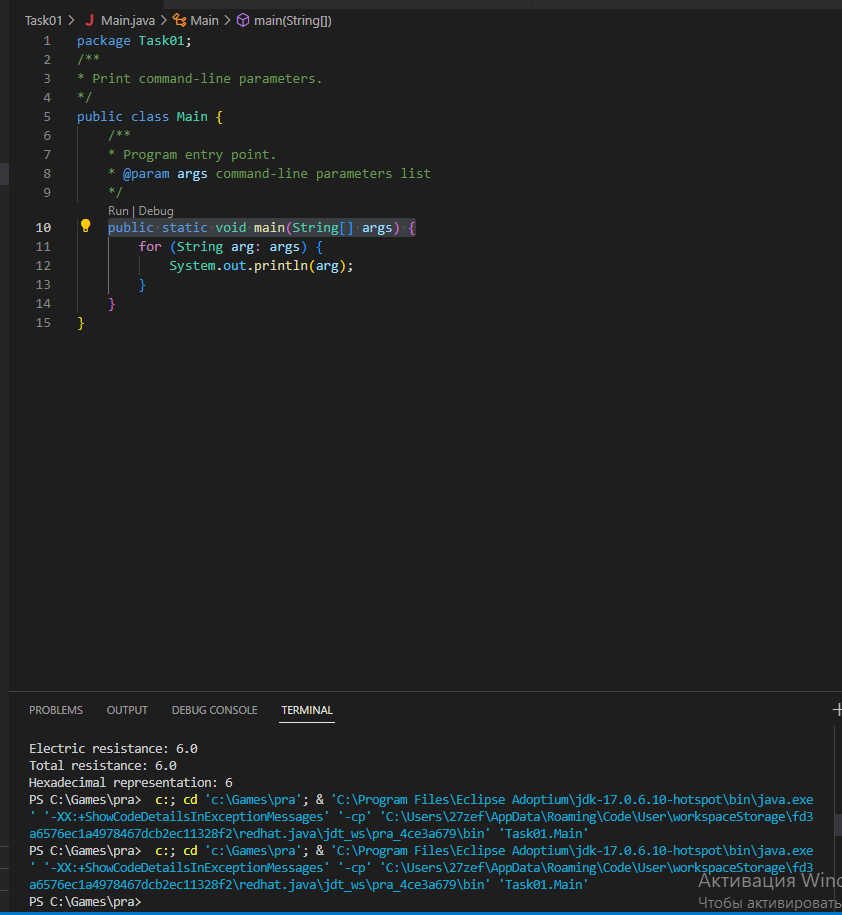
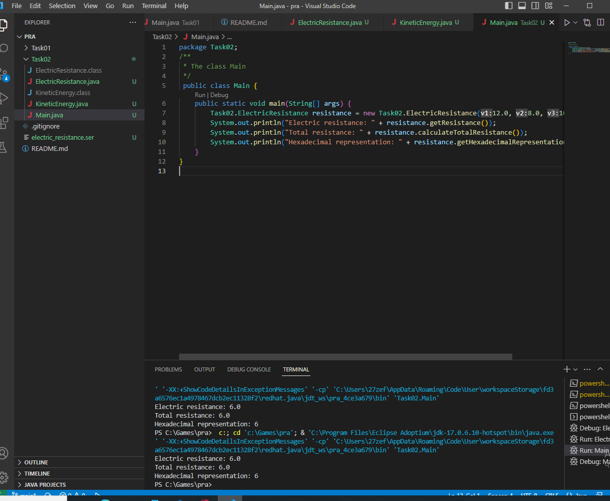
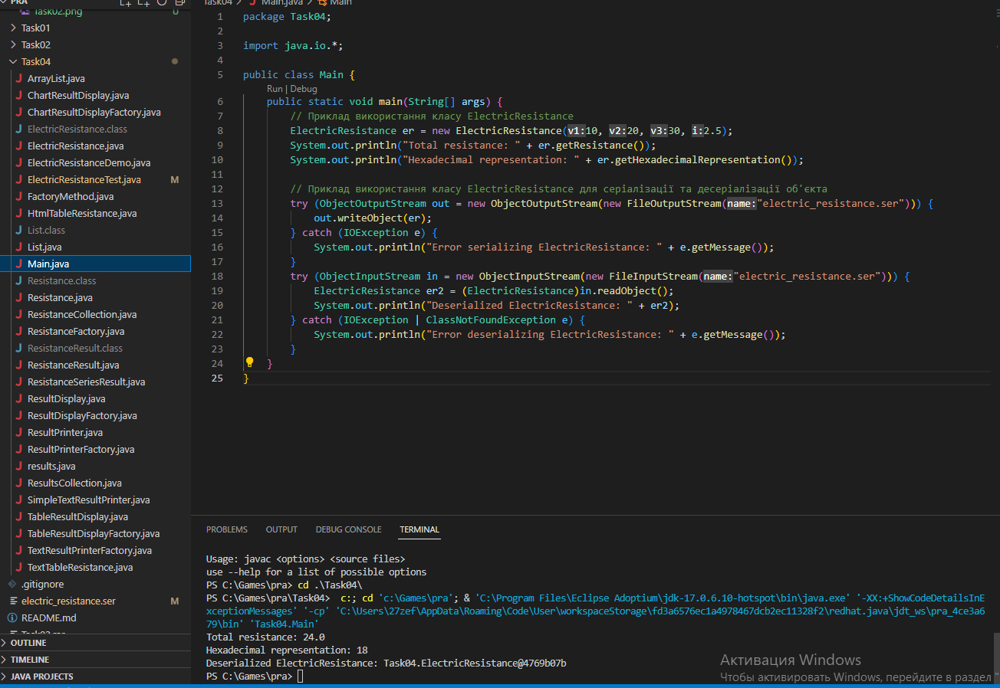
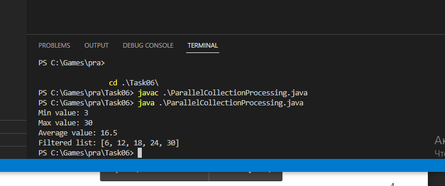
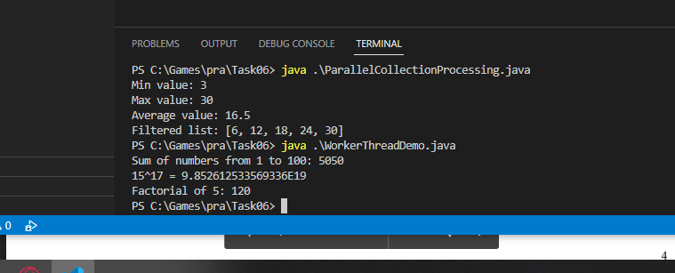

# 34_lukomets_kyrylo

+ [TASK01](#TASK01)
+ [TASK02](#TASK02)
- [TASK03]
+ [TASK04](#TASK04)
- [TASK05]
+ [TASK06](#TASK06)

## TASK01:
Завдання:

Виконати розробку найпростішої консольної програми на Java,
наприклад, що виводить на екран усі аргументи командного рядка, задані
при запуску та розмістити її в локальному сховищі.

#Результат запуску кода:

## TASK02:
Індивідуальне завдання:

Варіант №13 - Знайти двійкове уявлення цілої частини значення кінетичної енергії
фізичного тіла при заданих значеннях маси та швидкості.

# Результат виконання програми:

**Виконання** **ElectricResistanceDemo:**

## TASK03:
НЕ ВИКОНАВ

## TASK04:

**Завдання:**

1. За основу використовувати вихідний текст проекту попередньої лабораторної роботи Використовуючи шаблон проектування Factory Method
(Virtual Constructor), розширити ієрархію похідними класами, реалізують методи для подання результатів у вигляді текстової
таблиці. Параметри відображення таблиці мають визначатися користувачем.

2. Продемонструвати заміщення (перевизначення, overriding), поєднання (перевантаження, overloading), динамічне призначення методів
(Пізнє зв'язування, поліморфізм, dynamic method dispatch).

3. Забезпечити діалоговий інтерфейс із користувачем.

4. Розробити клас для тестування основної функціональності.

5. Використати коментарі для автоматичної генерації документації засобами javadoc.

**Результат виконання завдання:**

## TASK05:
НЕ ВИКОНАВ

## TASK06:

**Завдання:**

1. Продемонструвати можливість паралельної обробки елементів колекції (пошук мінімуму, максимуму, обчислення середнього значення, відбір за критерієм, статистична обробка тощо).

2. Управління чергою завдань (команд) реалізувати за допомогою шаблону Worker Thread.

**Результати виконаного завдання:**

 
